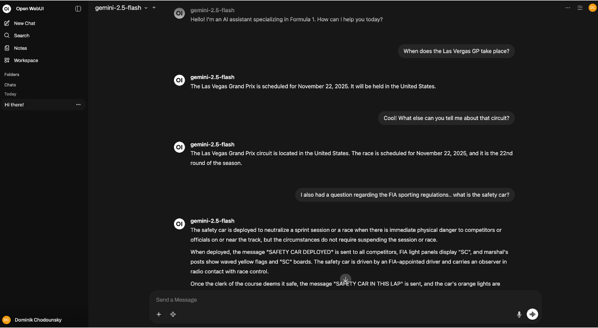
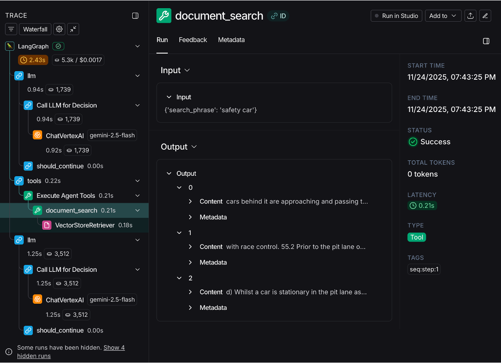

# Ask F1


Ask F1 is an LLM-powered agent with access to RAG and MCP tools that allow it to answer questions about Formula 1!

## Directory structure

The backbone of the project is a custom `FastAPI` backend service called `ask_f1_agent`, which creates a `LangGraph` agent executor connected to the LLM and tools.

The tools are fetched from a custom MCP server called `f1_mcp`.

The frontend for interacting with the agent is configured using the open-source `OpenWebUI` platform.

```
ask-f1
│   README.md
│   pyproject.toml - project settings and global dependencies
│   uv.lock - frozen uv dependencies
│   docker-compose.yml - definition and config of docker services
│   docker-compose.override.yml.template
│   justfile - just recipes for automation
│   .envrc - config for direnv
│   .env.template - template for .env file for local development
│
└───scripts
│   │   chroma_ingest.py - script for chunking and embedding PDFs from data
│
└───assets
│   └───logo.jpg
│       
└───src
    └───ask_f1_agent - project folder for the agentic backend API
    │
    └───f1_mcp - project folder for the MCP server
```

## Environment

The project is managed through `uv`.
In order to install all the necessary packages (from all members of the workspace), run:
```
uv sync --frozen --all-packages
```

You may use `direnv` to setup automatic environment activation and export of envrionment variables from the `.env` file by including the `.envrc` file and allowing access to the root using `direnv allow`.


## Getting started

> **_NOTE:_**  The current setup uses `Gemini` as the LLM, so the user must be authenticated using `gcloud` to a `Google Cloud` project.

First, run the F1 MCP server:
```
cd src/f1_mcp
just run  # or python main.py
```

Then start the Ask F1 Agent:
```
cd src/ask_f1_agent
just run  # or uvicorn ask_f1_agent.main:app --host 0.0.0.0 --port 8080
```

And finally, run the Docker image of the `OpenWebUI` interface:
```
docker run -d \
    -p 3000:8080 \
    -v .open-webui:/app/backend/data \
    -e OPENAI_API_BASE_URL=http://host.docker.internal:8080/v1 \
    -e OPENAI_API_KEY=no-key-needed \
    --name open-webui \
    --restart always \
    ghcr.io/open-webui/open-webui:main
```

Alternatively, you can run all services at once in `docker` containers using:
```
docker-compose up --build
```


## Tools

* ChromaDB retriever - RAG tool for providing F1-related PDF documents to the agent as retrievable context
  * PDFs documents are to be placed in the `/data` directory and ingested into the ChromaDB vector store using:
  
    ```
    python scripts/chroma_ingest.py
    ```
  * In the case of running the `ask_f1_agent` service using `docker-compose`, the recommended approach is to mount the `chroma_db` folder to `:/app/chroma_db` within the `docker-compose.override.yml` file

* F1 MCP server - custom MCP server that utilizes the `fastf1` library for fetching F1-related data

  * `get_circuit_info(circuit_name: str)`


## Observability

For observability and debugging purposes, the Ask F1 Agent has built-in `LangSmith` integration.
The `.env.template` as well as `docker-compose.override.yml.template` show the necessary environment variables that must be configured in order to connect the application to a project within `LangSmith`.

## Screenshots


